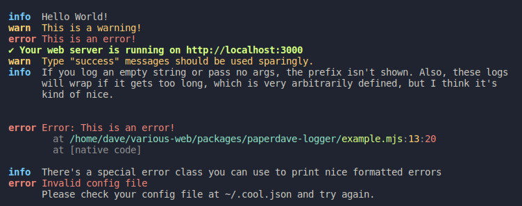

# @paperdave/logger

This is the logger I use in some of my programs, it has:

- Multiple levels, such as `debug` logs that aren't shown by default
- Widgets, dynamic and animatable things that stick to the bottom of your log:
  - Spinners (replaces `ora`)
  - Progress Bars (replaces `cli-progress` and alternatives)
  - Simple API for other widgets (specify and `fps` and implement a `format` function).
- Pretty error formatting.
  - Colorized and simplified stack traces.
  - For CLI Errors such as a missing configuration, attach a long-description to your errors to make them easier for users to debug.
- Does not depend on `chalk`, but rather a simple built-in color library. Also exports built-in versions of `is-unicode-supported` and `log-symbols`.
- Injecting the global `console` object to force all logs to be formatted.
- Bun and Node.js support



[Documentation](https://doc.deno.land/https://raw.githubusercontent.com/paperdave/various-web/main/packages/paperdave-logger/dist/index.d.ts) (i'm using deno doc however this module doesn't work with Deno)

## Basic Example

```ts
import log from '@paperdave/logger';

log.info('Hello World!');
log.warn('This is a warning!');
log.error('This is an error!');
log.debug('This is a debug message!');

log.setLevel('debug'); // Default to `info`, unless `$DEBUG` is set.

// Use these sparingly, as they are intended for primary success messages, such as
// a web server listening on a port, or a Discord bot successfully logging in.
log.success('This is a success message!');
```

## Injecting `console.log` and other functions.

In Purplet, we inject `@paperdave/logger` into the `console` object. This allows the users' logs to appear nicely formatted.

```ts
import { injectLogger } from '@paperdave/logger';

injectLogger();
```

## Spinners and Progress Bars

The `Spinner` and `ProgressBar` bar classes instantly start rendering when constructed, and have various methods to update their state and resolve them.

```ts
import { Spinner } from '@paperdave/logger';
import { delay } from '@paperdave/utils';

const spinner = new Spinner({
  message: 'Loading...'
});
await delay(1000);
spinner.update('Still Loading...');
await delay(1000);
spinner.success('Done!');
```

## Custom Widgets

`LogWidget` is a base class for widgets. A widget is responsible for providing a `format(now) -> string` function, where `now` is the value of `performance.now()`, and then an `fps` constant which is set to 15 by default.

In addition to that, the (protected) api contains

- `remove` - remove the widget from the log
- `redraw` - forces a redraw
- `LogWidget.batchRedraw(fn)` - pass a fn and perform multiple log operations in a single batch, useful to optimize log + remove() calls.
